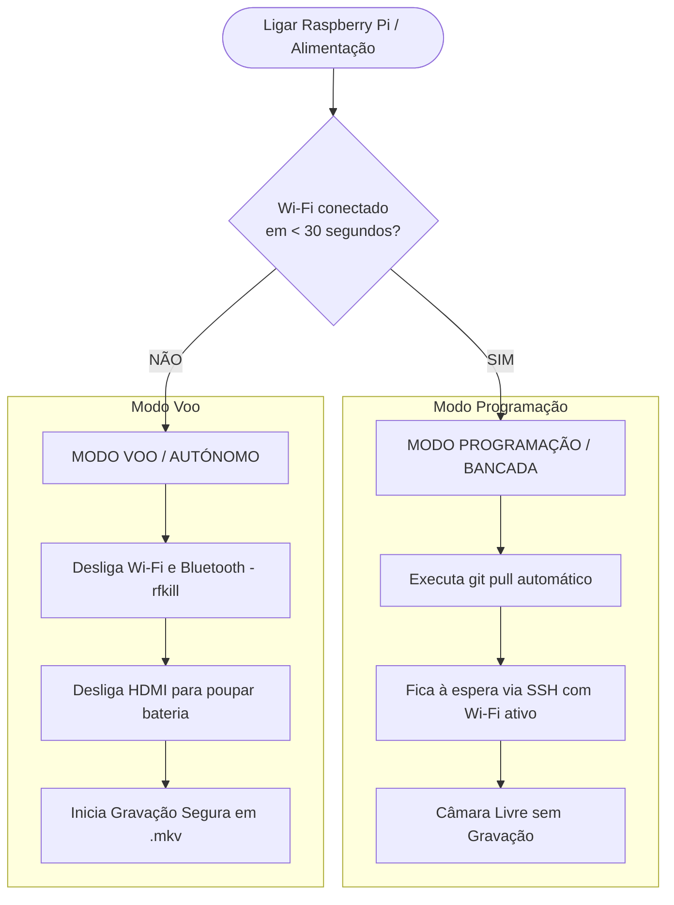

# MANTA_PI — Companion Computer Software Stack

Esta pasta contém o software de bordo concebido para correr no **Raspberry Pi 3 A+** com câmara **Sony IMX378-79** no UAV MANTA.

---

## 1. Gestor Autónomo de Arranque Dual-Mode (`manta_boot.sh`)
Ao ligar a alimentação do Raspberry Pi 3 A+, o serviço [`manta-boot.service`](file:///c:/Users/Afonso%20Noia/PycharmProjects/BlueSky/Code/MANTA_PI/manta-boot.service) é executado automaticamente e analisa o ambiente durante **30 segundos**:



### Cenário A — Com Wi-Fi (< 30s): **Modo Programação / Bancada**
- O avião está em bancada ou perto de casa ligado à rede Wi-Fi.
- O script deteta a ligação, atualiza automaticamente o código (`git pull origin untested`).
- O Wi-Fi e o SSH continuam ativos para comunicação com o PC.
- **Não inicia gravação de vídeo**, deixando a câmara e os recursos livres para transmissão em direto ou desenvolvimento.

### Cenário B — Sem Wi-Fi (Timeout 30s): **Modo Voo / Campo**
- O avião foi ligado no campo de voo (sem rede Wi-Fi).
- Após 30 segundos de tentativas:
  1. **Corte Total de Rádio RF**: Bloqueia Wi-Fi e Bluetooth (`rfkill block all`) para poupar bateria e eliminar interferências de 2.4 GHz com o recetor RC e o link LoRa.
  2. **Poupança de Energia**: Desliga os circuitos de saída de vídeo HDMI (`vcgencmd display_power 0`), poupando cerca de ~30 mA.
  3. **Gravação Contínua e Segura**: Inicia automaticamente o script `record_flight.sh` gravando o voo em `.mkv` sem perigo de corrupção caso a bateria se desligue.

---

## 2. Proteção Contra Quebras de Energia (Sem Corrupção)
Em voos com UAVs, a bateria LiPo pode desligar-se subitamente na aterragem ou impacto.
- **Problema do MP4 normal**: O índice (`moov` atom) só é gravado no fecho limpo do ficheiro. Se a energia for cortada, o ficheiro fica corrompido e ilegível.
- **Solução implementada (`.mkv` + `--flush`)**:
  - Utiliza o contentor **Matroska (`.mkv`)**, que grava cada bloco de fotogramas de forma autónoma e contínua.
  - A flag `--flush` força o sistema operativo a descarregar imediatamente os dados da RAM para a memória flash do cartão SD.
  - **Resultado**: Mesmo com corte súbito de alimentação a meio do voo, **o vídeo permanece 100% íntegro e reproduzível até ao último segundo antes do corte**.

---

## 3. Otimização Anti-Vibração & Anti-Jello (Motor UAV)
Os motores elétricos provocam vibrações de alta frequência que causam o efeito ondulado (*jello effect*) em sensores CMOS Rolling Shutter.
Os scripts implementam as seguintes mitigações óticas e de leitura do sensor IMX378:

1. **Modo de Leitura Rápido (2x2 Pixel Binning 2028x1080)**:
   - O sensor IMX378 lê as linhas muito mais depressa neste modo do que na resolução total (4056x3040), cortando o atraso de varrimento para metade e reduzindo o *jello*.
2. **Prioridade de Obturador Rápido (`--exposure sport`)**:
   - Força o algoritmo de exposição automática a manter o tempo de abertura do obturador (*shutter speed*) no mínimo possível (aumentando ganho analógico em vez de arrastar o tempo de exposição).
   - Para dias claros com muito sol, pode ser passado um shutter fixo ainda mais rápido (ex: `SHUTTER_US=2000` -> 1/500s ou `1000` -> 1/1000s).
3. **Denoise Temporal Desligado (`--denoise cdn_off`)**:
   - Evita que filtros de suavização misturem ruído de vibração entre frames, eliminando o efeito fantasma ou borrão de contornos.
4. **Codificação H.264 por Hardware (`bcm2835-codec`)**:
   - Codificação acelerada pelo hardware do processador BCM2837, sem sobrecarregar a CPU nem perder fotogramas.

---

## 4. Ficheiros Incluídos

| Ficheiro | Descrição |
|---|---|
| [`manta_boot.sh`](file:///c:/Users/Afonso%20Noia/PycharmProjects/BlueSky/Code/MANTA_PI/manta_boot.sh) | Gestor autónomo de boot (Dual-Mode: 30s Wi-Fi check -> Dev ou Voo). |
| [`manta-boot.service`](file:///c:/Users/Afonso%20Noia/PycharmProjects/BlueSky/Code/MANTA_PI/manta-boot.service) | Serviço systemd para arranque automático no boot do sistema. |
| [`record_flight.sh`](file:///c:/Users/Afonso%20Noia/PycharmProjects/BlueSky/Code/MANTA_PI/record_flight.sh) | Script Bash de gravação de voo com data/hora automática e proteção de disco. |
| [`record_flight.py`](file:///c:/Users/Afonso%20Noia/PycharmProjects/BlueSky/Code/MANTA_PI/record_flight.py) | Controlador Python com argumentos CLI (`--fps`, `--shutter`, `--duration`). |
| [`stream_flight.sh`](file:///c:/Users/Afonso%20Noia/PycharmProjects/BlueSky/Code/MANTA_PI/stream_flight.sh) | Script para emissão de vídeo em direto de latência mínima para FPV via SSH. |

---

## 5. Como Ativar o Serviço de Boot no Raspberry Pi

Para ativar o arranque automático no Raspberry Pi:
```bash
# Copiar o ficheiro de serviço para o systemd
sudo cp /home/pc/MANTA/Code/MANTA_PI/manta-boot.service /etc/systemd/system/

# Recarregar e ativar no arranque
sudo systemctl daemon-reload
sudo systemctl enable manta-boot.service
```

Para verificar o log do último arranque:
```bash
journalctl -u manta-boot.service -n 50
```

---

## 6. Como Sincronizar Apenas Esta Pasta no Raspberry Pi (Sparse-Checkout)

Para clonar e atualizar exclusivamente esta pasta no Raspberry Pi (sem descarregar o restante repositório):
```bash
# 1. Clonar apenas os metadados (sem blobs nem ficheiros pesados)
git clone --filter=blob:none --no-checkout https://github.com/afonsonoia/MANTA.git /home/pc/MANTA
cd /home/pc/MANTA

# 2. Configurar sparse-checkout apenas para Code/MANTA_PI
git sparse-checkout init --cone
git sparse-checkout set "Code/MANTA_PI"

# 3. Extrair os ficheiros do ramo ativo
git checkout untested
```

Para atualizar no futuro:
```bash
git pull
```

