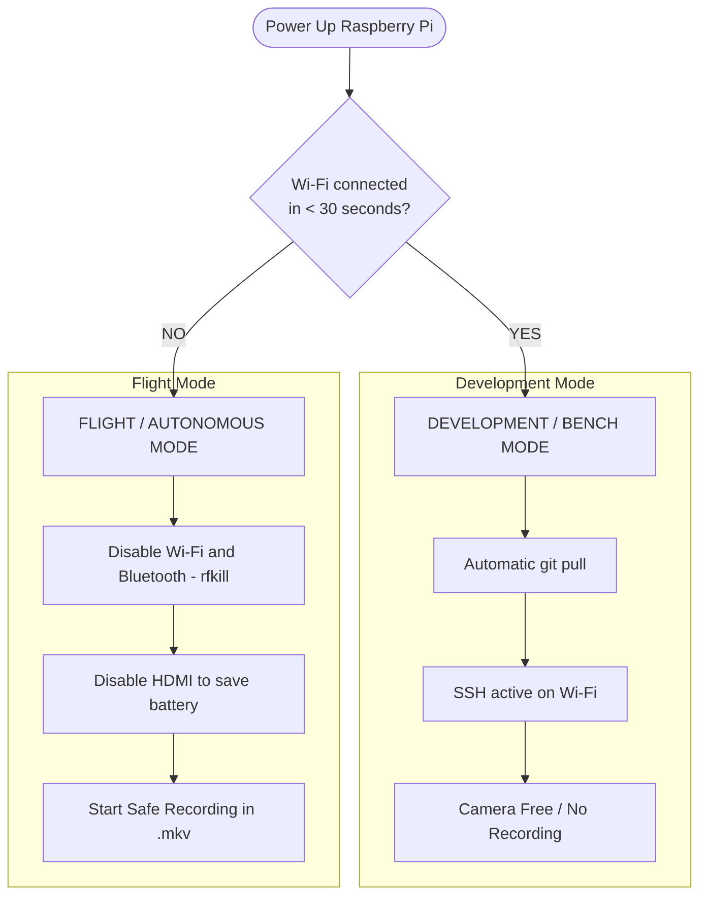

# MANTA_PI — Companion Computer Software Stack

This folder contains the onboard software designed to run on the **Raspberry Pi 3 A+** with a **Sony IMX378-79** camera module on the MANTA UAV.

---

## 1. Autonomous Dual-Mode Boot Manager (`manta_boot.sh`)
Upon powering up the Raspberry Pi 3 A+, the [`manta-boot.service`](file:///c:/Users/Afonso%20Noia/PycharmProjects/BlueSky/Code/MANTA_PI/manta-boot.service) systemd unit automatically executes and inspects the environment for **30 seconds**:


```mermaid
flowchart TD
    Boot([Power Up Raspberry Pi]) --> CheckWiFi{Wi-Fi connected\nin < 30 seconds?}
    CheckWiFi -- YES --> ModeDev[DEVELOPMENT / BENCH MODE]
    CheckWiFi -- NO --> ModeFlight[FLIGHT / AUTONOMOUS MODE]

    subgraph ModeDev_Details [Development Mode]
        ModeDev --> Pull[Automatic git pull]
        Pull --> Ready[SSH active on Wi-Fi]
        Ready --> NoRecord[Camera Free / No Recording]
    end

    subgraph ModeFlight_Details [Flight Mode]
        ModeFlight --> KillRF[Disable Wi-Fi and Bluetooth - rfkill]
        KillRF --> KillHDMI[Disable HDMI to save battery]
        KillHDMI --> AutoRecord[Start Safe Recording in .mkv]
    end
```

### Scenario A — Wi-Fi Connected (< 30s): **Development / Bench Mode**
- The aircraft is on the workbench or near home connected to the local Wi-Fi network.
- The script detects connectivity, pulls the latest code (`git pull origin untested`).
- Wi-Fi and SSH remain active for ground development and live testing.
- **Does not start video recording**, leaving the camera available for live streaming or CV development.

### Scenario B — No Wi-Fi (30s Timeout): **Flight / Field Mode**
- The aircraft is powered on at the flight field without a known Wi-Fi network.
- After 30 seconds:
  1. **Full RF Cutoff**: Blocks Wi-Fi and Bluetooth (`rfkill block all`) to conserve power and eliminate 2.4 GHz interference with the RC receiver and LoRa telemetry link.
  2. **Energy Conservation**: Powers down the HDMI display output circuitry (`vcgencmd display_power 0`), saving ~30 mA.
  3. **Continuous Safe Recording**: Automatically executes `record_flight.sh` saving video in `.mkv` with zero risk of corruption if power is cut upon landing.

### Anti-Lockout Protection
- If the Pi previously entered Flight Mode, `systemd-rfkill` and `NetworkManager` persist that blocked state across reboots.
- To prevent an infinite lockout cycle, the system uses multi-layer active unblocking on startup:
  1. **Systemd Level (`ExecStartPre=+`)**: Unblocks `rfkill` with root permissions before user processes run.
  2. **NetworkManager Level**: Forces wireless networking and Wi-Fi radios active (`nmcli radio wifi on`).
  3. **Interface Level**: Sets all `wl*` interfaces to operational `UP` state.
  4. **Radio Level**: Triggers an active `rescan` for fast AP association.
  5. **Accurate Detection**: Validates connectivity via assigned IPv4 and carrier state to prevent false negatives when routers block ICMP pings.

---

## 2. Power-Loss Immunity
In fixed-wing UAV operations, LiPo power may disconnect abruptly during landing or impact.
- Standard MP4 indexes (`moov` atom) are only written upon clean closure; abrupt cuts corrupt the file.
- **Matroska (`.mkv`) + continuous `--flush`**:
  - Encodes each frame cluster independently.
  - Forces synchronous flush from RAM to SD card.
  - **Result**: Video remains 100% playable right up to the final millisecond before power disconnection.

---

## 3. Anti-Vibration & Anti-Jello Optimization (Motor Noise)
Electric motors induce high-frequency vibrations that cause rolling shutter skew ("jello"):
1. **Fast Readout (2x2 Pixel Binning 2028x1080)**: Cuts sensor readout time in half, reducing rolling shutter skew.
2. **Sport Exposure (`--exposure sport`)**: Prioritizes minimum shutter duration to eliminate motion blur. Fixed shutter speeds can also be set (e.g. `SHUTTER_US=2000` -> 1/500s).
3. **Temporal Denoise Disabled (`--denoise cdn_off`)**: Eliminates ghosting artifacts across vibration cycles.
4. **Hardware H.264 Acceleration (`bcm2835-codec`)**: On-chip encoding with low CPU load.
5. **Focus Lock at Infinity (`--autofocus-mode manual --lens-position 0.0`)**: Eliminates focus hunting caused by airframe vibrations.

---

## 4. Included Files

| File | Description |
|---|---|
| [`manta_boot.sh`](file:///c:/Users/Afonso%20Noia/PycharmProjects/BlueSky/Code/MANTA_PI/manta_boot.sh) | Autonomous dual-mode boot manager (30s Wi-Fi check -> Dev or Flight). |
| [`manta-boot.service`](file:///c:/Users/Afonso%20Noia/PycharmProjects/BlueSky/Code/MANTA_PI/manta-boot.service) | Systemd unit file for automatic system startup execution. |
| [`record_flight.sh`](file:///c:/Users/Afonso%20Noia/PycharmProjects/BlueSky/Code/MANTA_PI/record_flight.sh) | Shell script for power-loss safe flight video recording. |
| [`record_flight.py`](file:///c:/Users/Afonso%20Noia/PycharmProjects/BlueSky/Code/MANTA_PI/record_flight.py) | Python CLI controller for video recording (`--fps`, `--shutter`, `--duration`). |
| [`stream_flight.sh`](file:///c:/Users/Afonso%20Noia/PycharmProjects/BlueSky/Code/MANTA_PI/stream_flight.sh) | Low-latency live FPV video stream script. |

---

## 5. Enabling the Boot Service on Raspberry Pi

```bash
sudo cp /home/pc/MANTA/Code/MANTA_PI/manta-boot.service /etc/systemd/system/
sudo systemctl daemon-reload
sudo systemctl enable manta-boot.service
```

To view boot logs:
```bash
journalctl -u manta-boot.service -n 50
```
