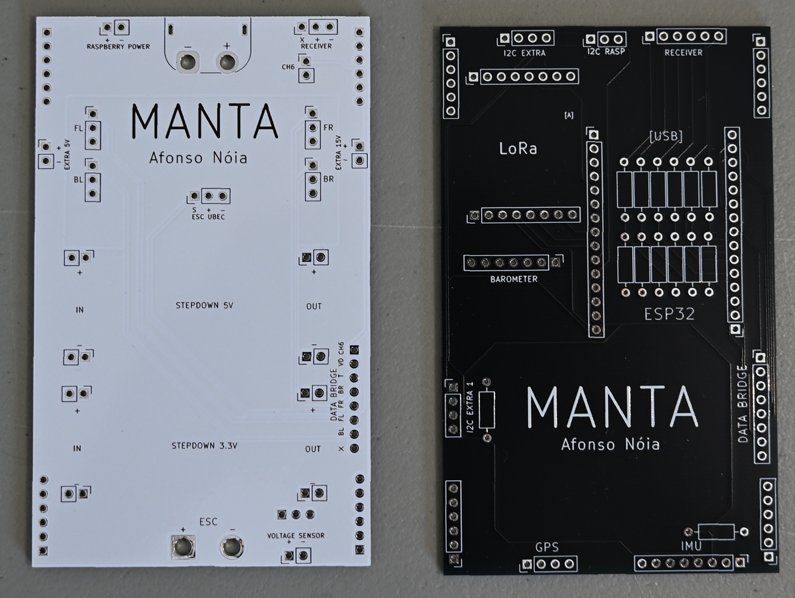
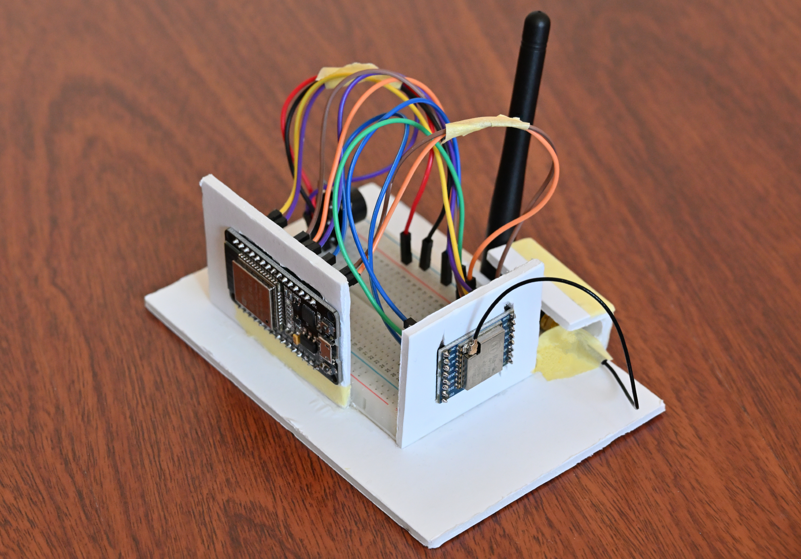

# MANTA – An Embedded AI Platform for Vision-Based Autonomous Flight


**MANTA is an experimental fixed-wing UAV research platform designed to investigate embedded computer vision and autonomous navigation in GPS-denied environments.**

## Why MANTA?

**Rather than being a commercial autopilot, MANTA is intended as an experimental platform for developing, testing and validating embedded perception and autonomous navigation algorithms under real flight conditions.**

**Current Development:** Conducting flight tests to build pilot confidence and airframe handling familiarity, while debugging minor sensor telemetry issues identified during maiden flights.

> *Fun Fact: The name **MANTA** is a regional term from Madeira Island, Portugal. It refers to the local population of the Common Buzzard (*Buteo buteo rothschildi*), a resident subspecies frequently seen soaring above the island's mountains.*

**Living Document:** This roadmap represents the current plan but is subject to change at any time as the project evolves, new challenges arise, or testing results dictate new priorities.

---

## Project Overview

The aircraft is powered by a hybrid architecture combining a low-level microcontroller for flight control and a companion computer for high-level intelligence and computer vision:

*   **Flight Controller (ESP32)**: Handles real-time tasks including sensor data acquisition, radio control (RC) receiver channel decoding (PWM/PPM), telemetry, and servo/ESC actuator outputs (PID control loops for elevator and roll stabilization).
*   **Companion Computer (Raspberry Pi 3 A+)**: Hosts the camera and executes lightweight computer vision pipelines for visual place recognition, estimating the aircraft's position by matching real-time imagery against a geo-referenced aerial database.
*   **Sensor Suite**:
    *   **GPS**: Primary navigation reference (when signal is active).
    *   **IMU (MPU6050)**: Accelerometer and Gyroscope for attitude estimation.
    *   **Barometer (BMP280)**: Altitude holding and barometric tracking.
    *   **Voltage Sensor**: Real-time battery cell monitoring.
    *   **Camera**: Captures ground features for visual localization.
*   **Custom PCBs (Shield Design)**: A custom two-board shield architecture designed in KiCad. This approach reduces manufacturing costs and results in a more compact footprint that easily fits within the airframe. It cleanly distributes power and interconnects the ESP32, Raspberry Pi, LoRa radio, sensor breakout boards, receiver, and servos. The design incorporates extensive GND copper pours around sensor zones, providing improved heat dissipation and reduced electromagnetic interference around sensitive electronics.
*   **Ground Station Receiver**: Dedicated ground hardware built with an ESP32 microcontroller, LoRa transceiver module, and an audible piezo buzzer. It streams telemetry to the PC Mission Planner application in real time while sounding acoustic warnings during critical safety events or link loss.

---

## Repository Structure

The project is structured as follows:

```
├── Code/
│   ├── Battery_Monitor/            # Raw battery voltage sensor data logger & ESC throttle control GUI
│   └── Computer Vision/
│       ├── demos/
│       │   └── MobileNet + KNN/        # Visual localization, image recognition & database loaders
│       ├── general_examples/           # ESP32 POCs (LoRa, Barometer, Receiver, Throttle/Voltage telemetry)
│       ├── Simulator/                  # Python-based flight simulator and autopilot PID tuning GUI
│       └── Test_2/Test_10_02_2026/     # Main low-level ESP32 test sketch (servo, battery, receiver input)
├── Electronics/
│   ├── MANTA.kicad_sch                 # Custom PCB Schematic
│   ├── MANTA.kicad_pcb                 # Custom PCB Layout
│   └── MANTA.kicad_pro                 # KiCad Project configuration
└── media/
    └── general_images/                 # Platform banner, physical hardware & PCB layout previews
```

---

## Current Project Status

*   **Low-Level Flight Controller Firmware**: ESP32 firmware running high-rate 100 Hz MPU6050 Mahony AHRS quaternion attitude estimation, uniform sensor sampling, RC receiver decoding (CH1–CH5), deadband filtering, calibrated battery voltage monitoring, and V-tail servo/ESC mixer outputs.
*   **IMU-Assisted Roll Envelope Protection**: Active fly-by-wire roll limitation and auto-recovery assistance running in real time on RC Channel 5.
*   **Robust LoRa Telemetry Link**: 20 Hz binary telemetry stream (SF8, BW 250kHz, CRC16) streaming attitude (pitch, roll, yaw), raw IMU, RC channels, battery voltage, barometric altitude, and RSSI/SNR metrics directly to the Ground Station ESP32 and Mission Planner bridge with automated sequential flight logging (`flight_logs/`).
*   **Voltage Sensor Calibration**: Rigorously calibrated conversion function validated against multimeter ground truth (< 0.062V error) backed by automated CI/CD accuracy tests.
*   **Airframe & Avionics Integration**: Custom KiCad manufactured power and data distribution PCB shields and core avionics are fully installed on the airframe.
*   **Flight Testing**: Maiden flights and field testing successfully conducted to validate airframe aerodynamics, motor thrust, control surface behavior, and live HUD attitude tracking in Mission Planner.
*   **CI/CD Pipeline**: 41 automated tests continuously validating firmware compilation (PlatformIO), telemetry codec integrity, and analytical sensor accuracy.
*   **Next Steps**: Further flight test tuning of closed-loop PID attitude stabilization (Pitch & Roll leveling) and preparation for autonomous waypoint navigation.

### Custom Manufactured PCBs

<p align="center">
  
</p>

<p align="center">
  
  
  <br>
  <em>KiCad PCB Layouts — Power Board & Data Board</em>
</p>

### Ground Station Hardware Prototype

<p align="center">
  
</p>

The Ground Station hardware acts as the physical telemetry link between the aircraft and ground operations:
* **ESP32 & LoRa Bridge**: Captures live wireless telemetry packets (battery state, RSSI/SNR signal levels, sensor telemetry) sent from the aircraft and streams them in real time to the PC Mission Planner software (`MANTA_MISSION_PLANNER.py`).
* **Acoustic Warning System**: Features an integrated piezo buzzer programmed to emit loud audio alerts (beeps) during critical events, low battery states, or sudden signal loss, immediately warning the pilot of emergencies without requiring constant monitor surveillance.

### IMU-Assisted Roll Envelope Protection (Fly-By-Wire Assist)

The flight controller integrates an intelligent **attitude-aware roll limitation and auto-recovery flight assist** mode driven in real time by the 6-axis MPU6050 IMU (Mahony AHRS quaternion fusion):

* **Direct Pilot Authority at Wings Level (0° Roll):** The pilot retains full ±20° rolleron control authority.
* **Progressive Bank Angle Attenuation:** As the aircraft banks, the maximum roll command authority into the direction of the turn decreases linearly to prevent overbanking:
  $$\text{Max Roll Authority} = 20^\circ \times \left(1 - \frac{|\text{Roll}|}{60^\circ}\right)$$
  * At **30° Roll:** Maximum roll command into the bank is limited to **10°**.
  * At **45° Roll:** Maximum roll command into the bank is limited to **5°**.
  * At **60° Roll:** Pilot command into the bank is fully restricted (**0°**).
* **Active Auto-Recovery Bias (>60° Bank Angle):** If the aircraft exceeds 60° of bank (e.g. 70° right), commands into the bank are overridden and the system automatically applies **5° of opposite recovery deflection** to level the wings, while preserving full pilot recovery stick authority.
* **Transmitter Flight Mode Switch (CH5):** Selectable in real time via RC Channel 5 (`CH5 = 2000µs` enables Roll Envelope Assist; `CH5 = 1000µs` selects direct manual passthrough).

---

## Project Roadmap

### Phase 1: Hardware Proof-of-Concepts (POC)
- [x] Establish ESP32 communications with peripheral sensors (BMP280, LoRa, Voltage sensor).
- [x] Implement RC receiver pulse width reading and telemetry logs.
- [x] Establish initial LoRa communication between aircraft and ground station.
- [x] Set up lightweight visual place recognition experiments using aerial imagery databases.
- [x] Perform isolated bench tests for each sensor to ensure accuracy and data reliability.

### Phase 2: Airframe Assembly & Avionics Integration
- [x] Assemble the main airframe skeleton and mount propulsion/control surfaces.
- [x] Complete custom KiCad PCB schematics (`MANTA.kicad_sch`) and layout routing.
- [x] Manufacture physical dual-board PCB shield architecture (Power & Data boards).
- [x] Assemble PCBs and validate power distribution, BEC outputs, and sensor bus continuity.
- [x] Experimentally calibrate raw ADC battery voltage conversion against multimeter ground truth.
- [x] Mount core avionics and electronics on the airframe (Raspberry Pi & camera deferred for visual localization phase).
- [x] Conduct EMI testing ensuring motor/ESC switching noise does not disrupt GPS or LoRa RF link.
- [x] Deploy robust LoRa telemetry (SF8, 20 Hz binary codec, non-blocking asynchronous Ground Station logging).
- [x] Execute maiden field tests in manual flight mode to validate airframe aerodynamics and real-time ground station telemetry streaming.

### Phase 3: Flight Control & Fly-By-Wire Stabilization
- [x] Integrate 6-axis MPU6050 Mahony AHRS quaternion sensor fusion into low-level ESP32 firmware for high-rate, low-drift attitude estimation.
- [x] Implement attitude-aware roll envelope protection and progressive bank angle limiting on RC Channel 5.
- [ ] Implement and calibrate closed-loop PID controllers for Pitch (rear V-tail elevators) and Roll (front rollerons).
- [ ] Conduct field flight tests to calibrate PIDs for smooth, wind-resistant fly-by-wire leveling and stability.
- [ ] Execute extensive flight testing under varied weather conditions to thoroughly validate closed-loop stability before moving to Phase 4.

### Phase 4: Autonomous Waypoint Navigation & LoRa Path-Planning
- [ ] Implement interactive trajectory planner in PC Ground Station UI to select waypoints (e.g., 5-point flight path) on a map.
- [ ] Transmit pre-planned path coordinates from Mission Planner to aircraft over LoRa wireless link.
- [ ] Develop onboard navigation controller fusing GPS, BMP280 barometric altitude, and IMU data.
- [ ] Validate autonomous waypoint-to-waypoint navigation, altitude hold, heading lock, and fail-safe Return-to-Home (RTH).
- [ ] Execute extensive autonomous field flight missions to rigorously verify trajectory accuracy and fail-safe reliability prior to Phase 5.

### Phase 5: Onboard Vision & Companion Computer Integration (Raspberry Pi)
- [ ] Design custom mount and install Raspberry Pi 3 A+ companion computer and camera module on airframe.
- [ ] Set up ESP32-to-Raspberry Pi high-speed serial communication protocol (UART / MAVLink-like packets).
- [ ] Execute onboard high-rate image/sensor data logging and telemetry synchronization.
- [ ] Deploy lightweight Visual Place Recognition (VPR) for image-based GPS-denied position estimation.
- [ ] Develop computer vision pipelines for visual horizon detection and landmark/mountain recognition (matching camera imagery with elevation map databases for visual localization).
- [ ] Test real-time object detection and visual perception during autonomous flight.
- [ ] Perform comprehensive flight validation campaigns to evaluate vision-based localization precision and system integration under real operational conditions.

### Long-Term Research Directions
- Visual-Inertial State Estimation
- Lightweight onboard perception
- Embedded neural network optimization
- Sensor fusion for robust navigation
- Dataset acquisition and evaluation
- Fully autonomous visual flight in GNSS-degraded environments
