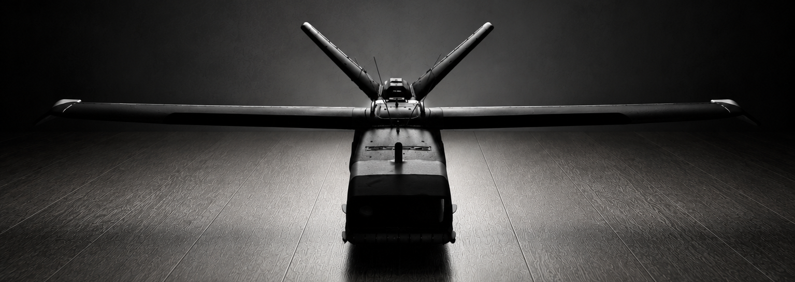
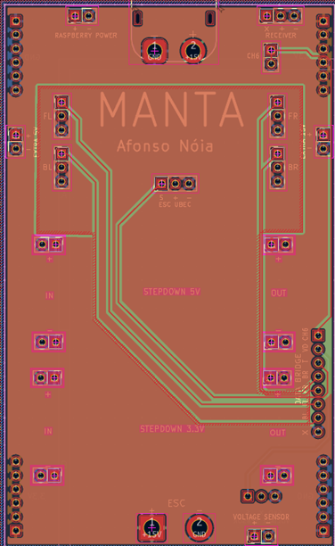
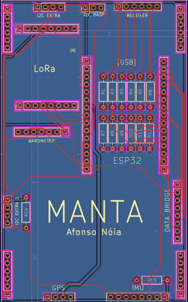

# MANTA - Autonomous RC Plane with Camera-Based Localization



Welcome to the **MANTA** (BlueSky) project! The goal of this project is to design, build, and fly an autonomous RC plane capable of navigating safely in **GPS-denied environments** using camera-based visual localization. 

**Living Document:** This roadmap represents the current plan but is subject to change at any time as the project evolves, new challenges arise, or testing results dictate new priorities.

---

## Project Overview

The aircraft is powered by a hybrid architecture combining a low-level microcontroller for flight stability/control and a companion computer for high-level intelligence and computer vision:

*   **Flight Controller (ESP32)**: Handles real-time tasks including sensor data acquisition, radio control (RC) receiver channel decoding (PWM/PPM), telemetry, and servo/ESC actuator outputs (PIDs for elevator and roll stabilization).
*   **Companion Computer (Raspberry Pi 3 A+)**: Hosts the camera and runs computer vision workloads (MobileNet feature extraction + KNN signature matching) to estimate geographical position by comparing real-time video frames with pre-compiled geo-referenced aerial database maps.
*   **Sensor Suite**:
    *   **GPS**: Primary navigation reference (when signal is active).
    *   **IMU (MPU6050)**: Accelerometer and Gyroscope for attitude estimation.
    *   **Barometer (BMP280)**: Altitude holding and barometric tracking.
    *   **Voltage Sensor**: Real-time battery cell monitoring.
    *   **Camera**: Captures ground features for visual localization.
*   **Custom PCBs (Shield Design)**: A custom 2-board KiCad-designed system that unites as a shield. This approach reduces manufacturing costs and results in a more compact footprint that easily fits within the airframe. It cleanly distributes power and interconnects the ESP32, Raspberry Pi, LoRa radio, sensor breakout boards, receiver, and servos. The design incorporates extensive GND copper pours around sensor zones, providing excellent thermodynamic properties and robust protection against electromagnetic interference (EMI).

---

## Repository Structure

The project is structured as follows:

```
├── Code/
│   └── Computer Vision/
│       ├── demos/
│       │   └── MobileNet + KNN/        # Visual localization, image recognition & database loaders
│       ├── general_examples/           # ESP32 POCs (LoRa, Barometer, Receiver, Throttle/Voltage telemetry)
│       ├── Simulator/                  # Python-based flight simulator and autopilot PID tuning GUI
│       └── Test_2/Test_10_02_2026/     # Main low-level ESP32 test sketch (servo, battery, receiver input)
└── Electronics/
    ├── MANTA.kicad_sch                 # Custom PCB Schematic
    ├── MANTA.kicad_pcb                 # Custom PCB Layout
    └── MANTA.kicad_pro                 # KiCad Project configuration
```

---

## Current Project Status

*   **Low-Level Firmware**: ESP32 test sketch successfully integrates PWM receiver input reading, deadband smoothing, battery percentage estimation, and servo/ESC command output.
*   **Visual Navigation**: Python POCs demonstrate feature extraction using lightweight MobileNet structures combined with a KNN classifier to predict coordinates based on matching signatures.
*   **Electronics**: Custom KiCad PCBs (utilizing the new compact 2-board shield architecture) have been successfully manufactured and we now have the physical boards! We are currently finalizing the electrical assembly on the airframe.
*   **Simulation**: Basic PyQt-based simulation setup created for autopilot PID tuning loops.
*   **Next Steps**: Preparing to run electronics tests to validate power distribution and signals before the first manual test flight.

### PCB Previews

<p align="center">
  
  
</p>

---

## Project Roadmap

### Phase 1: Hardware Proof-of-Concepts (POC)
- [x] Establish ESP32 communications with peripheral sensors (BMP280, LoRa, Voltage sensor).
- [x] Implement RC receiver pulse width reading and telemetry logs.
- [x] Set up MobileNet+KNN visual matching tests using local spatial imagery databases.
- [x] Perform isolated bench tests for each sensor to ensure accuracy and data reliability.

### Phase 2: Airframe Assembly & Avionics Integration
- [x] Finish assembling the main airframe skeleton from the purchased KIT.
- [x] Complete custom KiCad PCB schematic (`MANTA.kicad_sch`).
- [x] Finalize PCB routing, trace widths for power distribution, and manufacture the board.
- [x] Assemble the PCB and perform physical continuity and power testing.
- [ ] Design and build a sturdy, custom mount for the Raspberry Pi camera module.
- [ ] Mount avionics (ESP32, Raspberry Pi, camera, sensors) on the airframe.
- [ ] Conduct EMI (Electromagnetic Interference) testing to ensure motors/ESCs don't disrupt the GPS or LoRa signals.
- [ ] Execute maiden field test in manual flight mode to validate airframe aerodynamics and real-time ground station telemetry streaming.

### Phase 3: Software, Autopilot & Path-Planning
- [ ] Integrate IMU (MPU6050) Kalman/Complementary filtering into low-level ESP32 firmware.
- [ ] Implement robust pitch (elevator) and roll (aileron) stabilization PIDs.
- [ ] Perform static PID tuning on a test rig (without flying) to evaluate control surface responsiveness.
- [ ] Set up ESP32-to-Raspberry Pi serial communication protocol (UART/MAVLink-like packets).
- [ ] Implement high-level LoRa telemetry control (e.g., "go to waypoint X").
- [ ] Develop and integrate an autonomous path-planning algorithm.

### Phase 4: Ground Station & Virtual FPV
- [ ] Implement a basic Virtual FPV on the ground station (using telemetry, altitude, coordinates, and 3D maps) to artificially generate the pilot's view for terrain avoidance.
- [ ] Enhance Virtual FPV by streaming additional camera/sensor data to realistically detect and display obstacles like trees.
- [ ] Conduct field tests to evaluate LoRa telemetry maximum range, packet loss, and Virtual FPV rendering latency.

### Phase 5: Vision-Based Visual Odometry (GPS-Denied)
- [ ] Optimize the MobileNet feature extraction pipeline on Raspberry Pi 3 A+.
- [ ] Establish offline local WMS map compilation and database caching.
- [ ] Capture raw aerial video datasets during manual flights to validate and train the CV model offline.
- [ ] Develop failsafe logic to transition autopilot navigation to visual tracking upon GPS signal loss.

### Phase 6: Iterative Flight Testing & Autonomous Validation
- [ ] Perform manual Line-of-Sight (LOS) flight tests to evaluate the Center of Gravity (CG) and basic aerodynamics.
- [ ] Conduct tethered/ground vibration testing to calibrate sensors under heavy motor load.
- [ ] Run hardware-in-the-loop (HIL) simulations using logged manual flight data to refine the autopilot.
- [ ] Execute semi-autonomous flights (LoRa waypoint commands) keeping manual RC override as a safety net.
- [ ] Conduct the first fully autonomous flight trials relying solely on Vision-Based Odometry (GPS-denied simulation).
- [ ] Continuously review flight logs after each test to fine-tune PIDs, computer vision thresholds, and path-planning behaviors.
