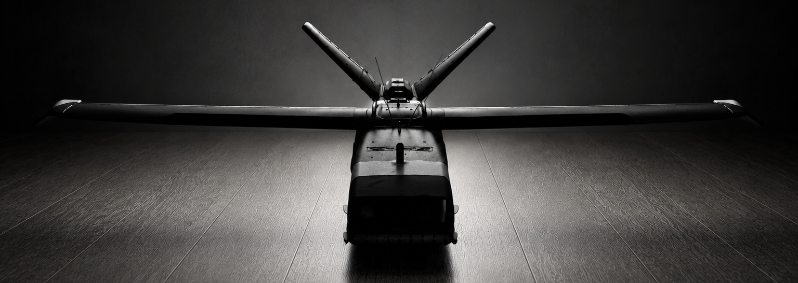
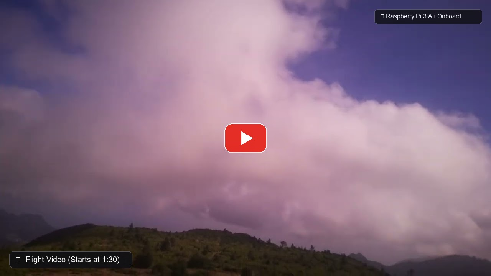
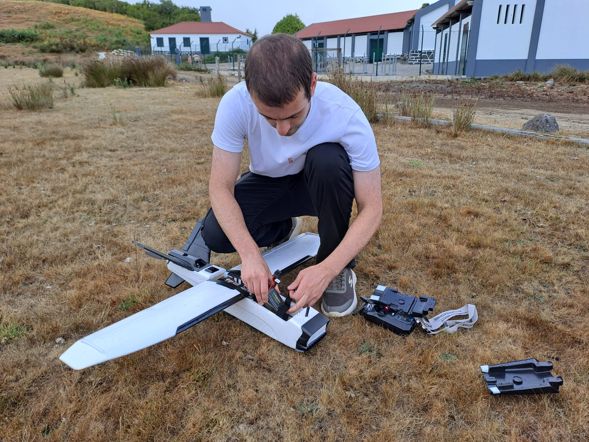
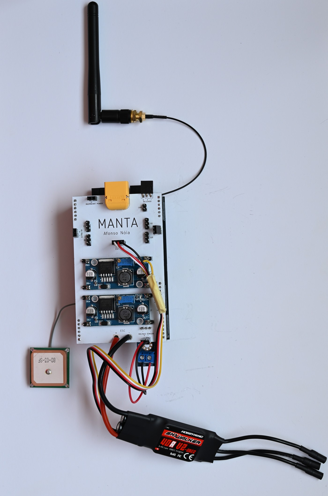
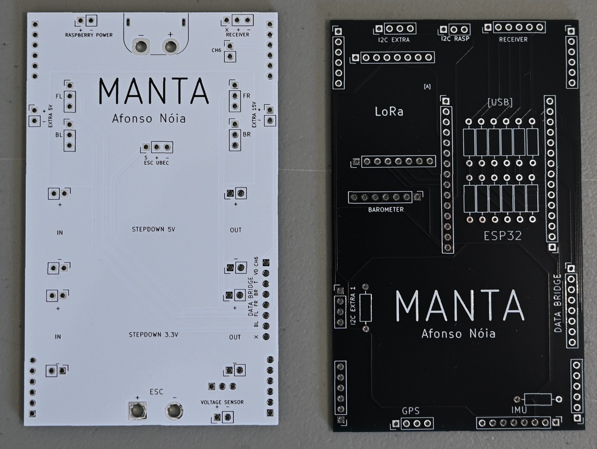
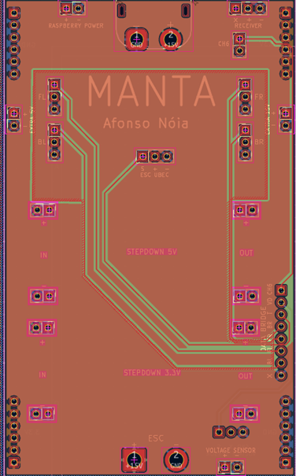
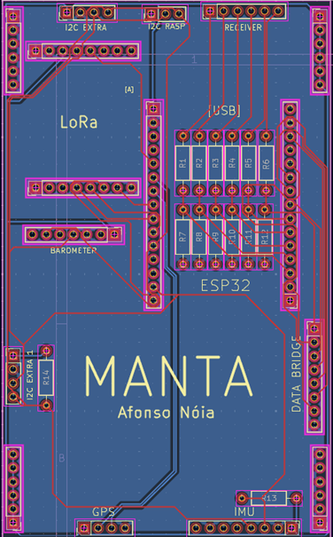
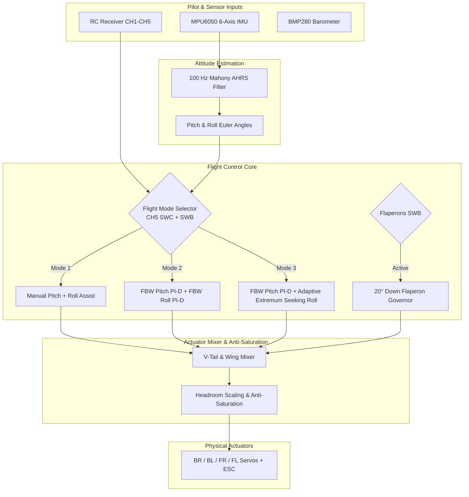
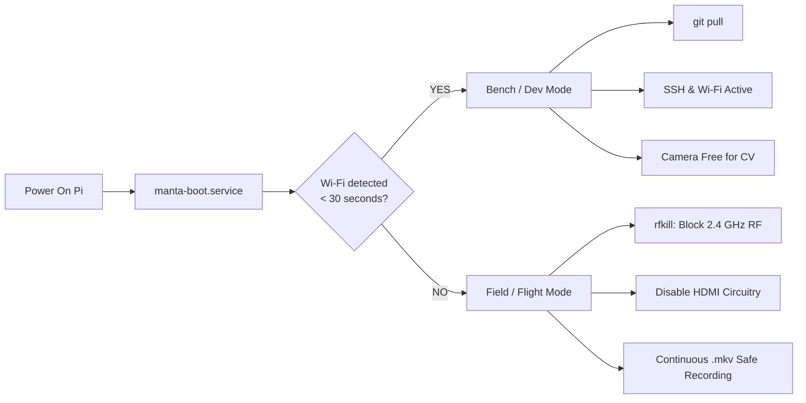
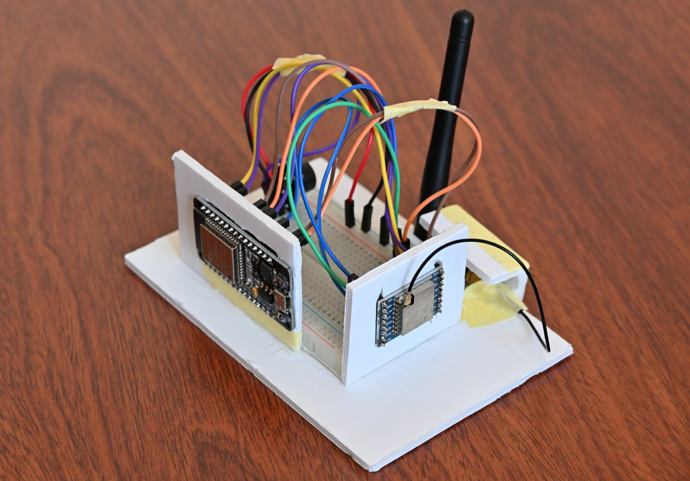

# MANTA – Embedded AI & Vision-Guided Autonomous Flight Platform

<p align="center">
  
</p>

<p align="center">
  
  
  
  
  
  
</p>

**MANTA** is an experimental fixed-wing UAV research platform designed for investigating embedded computer vision, attitude stabilization, and autonomous navigation in GPS-denied environments.

Rather than relying on commercial black-box autopilots, MANTA is engineered from the ground up as an open, modular avionics architecture: combining low-level deterministic real-time control (ESP32) with high-level onboard perception and video recording (Raspberry Pi 3 A+ companion computer).

> **Origin of the Name**: *MANTA* is a regional term from Madeira Island, Portugal, designating the local population of the Common Buzzard (*Buteo buteo rothschildi*), a resident bird of prey known for soaring effortlessly across the island's steep oceanic mountains.

---

## In-Flight Validation & Onboard Camera Footage

MANTA has achieved fully stabilized flight under closed-loop fly-by-wire control with calibrated attitude PIDs, verified aerodynamic handling, and active onboard video recording.

The companion computer (**Raspberry Pi 3 A+**) flies onboard with a dedicated camera module, executing an autonomous power-loss-immune recording pipeline (`.mkv`) with sport shutter tuning to eliminate motor vibration artifacts and rolling shutter jello.

### Onboard Flight Video

<p align="center">
  <a href="https://www.youtube.com/watch?v=h6kUTQn7zuM&t=90s" target="_blank" rel="noopener noreferrer" title="Click to watch MANTA flight video on YouTube starting at 1:30 min">
    
  </a>
  <br>
  <em>▶️ <b>Watch the flight video</b> — Aerial footage captured directly by the onboard Raspberry Pi 3 A+ camera during flight tests. <b><a href="https://www.youtube.com/watch?v=h6kUTQn7zuM&t=90s" target="_blank">Click here or on the image above to play on YouTube starting at 1:30 min</a></b>.</em>
</p>

### Pre-Flight Preparation & Avionics Checkout

<p align="center">
  
  <br>
  <em>Pre-flight checkout at the flight field: LiPo battery installation, 6-axis IMU zeroing, radio link verification, and autonomous companion computer boot sequence before launch.</em>
</p>

During field operations, pre-flight checks verify the full avionics chain:
1. **Airframe & Propulsion**: 4S LiPo battery securement, Hobbywing Skywalker 40A V2 ESC throttle arming, and control horn linkage checks.
2. **IMU & Attitude Zeroing**: Static 6-axis MPU6050 accelerometer and gyroscope calibration with mounting offsets (+9.2° Pitch, +4.4° Roll).
3. **Control Surface Trims**: V-tail ruddervator and elevon zero-point verification across all 4 servos within calibrated hardware limits.
4. **LoRa Telemetry Handshake**: 20 Hz binary telemetry downlink reception and acoustic buzzer confirmation on the Ground Station ESP32.
5. **Companion Boot**: Autonomous transition of the Raspberry Pi 3 A+ into Field Mode with RF blocking and continuous video capture.

---

## Avionics & Embedded Hardware Architecture

MANTA uses a custom-manufactured dual-board shield architecture designed in KiCad, cleanly distributing high-current motor power and low-noise sensor signals while fitting into the airframe fuselage.

<p align="center">
  
  <br>
  <em>Complete assembled avionics stack: Custom dual-board PCB shield, ESP32 flight controller, LoRa 433 MHz RF link, Air530 GPS antenna, dual LM2596S switching buck converters, precision voltage divider, and Hobbywing Skywalker 40A V2-UBEC ESC.</em>
</p>

### Core Hardware Components

| Subsystem | Component | Role / Specification |
|---|---|---|
| **Flight Controller** | ESP32-WROOM-32 (240 MHz Dual-Core) | Real-time 100 Hz attitude estimation, RC receiver pulse decoding, PI-D control loops, V-tail servo mixing, and 20 Hz LoRa telemetry. |
| **Companion Computer** | Raspberry Pi 3 A+ (64-bit Quad-Core) | Camera management, high-bitrate in-flight video recording, visual place recognition (VPR), and future autonomous vision navigation. |
| **In-Flight Camera** | Sony IMX378-79 Sensor Module | High-resolution aerial video capture, 2x2 binned low-latency readout, and visual feature extraction. |
| **Inertial Measurement (IMU)** | MPU6050 (6-Axis Accel / Gyro) | High-rate attitude determination running Mahony AHRS quaternion fusion filter at 100 Hz. |
| **Barometric Altimeter** | BMP280 | Static pressure sensing, relative barometric altitude tracking, and vertical velocity estimation over I2C. |
| **RF Telemetry Link** | SX1278 LoRa Transceiver (433 MHz) | Long-range 20 Hz binary telemetry downlink (SF7, BW 250 kHz, CR 4/5, CRC16) streaming flight dynamics to the ground. |
| **Satellite Navigation** | Air530 Multi-GNSS Module | Global positioning reference, ground track velocity, and satellite constellation tracking over hardware UART. |
| **Electronic Speed Control (ESC)** | Hobbywing Skywalker 40A V2-UBEC | 3S–4S LiPo motor speed control with integrated 5V/5A switching BEC powering the avionics bus. |
| **Power Regulation** | Dual LM2596S DC-DC Regulators | Independent 5.1V / 3A power rails dedicated to the Raspberry Pi companion computer and servo bus, isolating control logic from servo voltage sag. |
| **Battery Monitoring** | Precision Calibrated Voltage Divider | Calibrated ADC sensing validated to within 0.062V of multimeter ground truth across 3S/4S voltage curves. |

### Custom Manufactured PCB Shields

<p align="center">
  
</p>

<p align="center">
  
  
  <br>
  <em>KiCad Dual-Board Shield Layouts: Power Distribution Board & Data / Sensor Board</em>
</p>

- **Two-Board Architecture**: Separates noisy high-current traces (motor ESC, LiPo leads, buck regulators) on the Power Board from sensitive analog sensors (MPU6050, BMP280, LoRa SPI bus, RC receiver lines) on the Data Board.
- **Continuous Ground Pours**: Low-impedance ground returns and copper shielding prevent motor/ESC switching noise from coupling into the RF frontend or ADC measurements.

### Pinout & GPIO Mapping

```
RC Receiver Inputs:                  Servo & ESC Outputs:
  CH1 (Roll / Rollerons): Pin D39      Back Right (BR / V-Tail): Pin D13
  CH2 (Pitch / Elevator): Pin D34      Back Left  (BL / V-Tail): Pin D14
  CH3 (Throttle / ESC):   Pin D35      Front Right (FR / Flap):  Pin D27
  CH4 (Aux / Rudder):     Pin D32      Front Left  (FL / Flap):  Pin D26
  CH5 (Mode SWC + SWB):   Pin D33      Motor Throttle / ESC:     Pin D25

Buses & Peripherals:
  LoRa SX1278 (VSPI):     SCK=18, MISO=19, MOSI=23, CS=5, DIO0=4
  I2C Sensors (IMU+BMP):  SDA=21, SCL=22
  Air530 GNSS (UART2):    RX2=16, TX2=17
  Battery Voltage ADC:    Pin D36 (VP)
```

---

## Flight Control Architecture & Calibrated PIDs

MANTA utilizes a hybrid V-tail mixing scheme where Pitch is controlled by the rear ruddervators (BR/BL) and Roll is controlled by the front control surfaces (FR/FL), with elevator assist.


```mermaid
flowchart TD
    subgraph Inputs [Pilot & Sensor Inputs]
        RC[RC Receiver CH1-CH5]
        IMU[MPU6050 6-Axis IMU]
        BARO[BMP280 Barometer]
    end

    subgraph StateEst [Attitude Estimation]
        IMU --> Mahony[100 Hz Mahony AHRS Filter]
        Mahony --> Att[Pitch & Roll Euler Angles]
    end

    subgraph ControlCore [Flight Control Core]
        RC --> ModeSelect{Flight Mode Selector\nCH5 SWC + SWB}
        Att --> ModeSelect

        ModeSelect -->|Mode 1| M1[Manual Pitch + Roll Assist]
        ModeSelect -->|Mode 2| M2[FBW Pitch PI-D + FBW Roll PI-D]
        ModeSelect -->|Mode 3| M3[FBW Pitch PI-D + Adaptive Extremum Seeking Roll]

        SWB{Flaperons SWB} -->|Active| Flaps[20° Down Flaperon Governor]
    end

    subgraph Mixing [Actuator Mixer & Anti-Saturation]
        M1 & M2 & M3 --> Mixer[V-Tail & Wing Mixer]
        Flaps --> Mixer
        Mixer --> Headroom[Headroom Scaling & Anti-Saturation]
    end

    subgraph Outputs [Physical Actuators]
        Headroom --> Servos[BR / BL / FR / FL Servos + ESC]
    end
```

### Flight Modes (Transmitter CH5: SWC + SWB)

The pilot switches flight modes in real time via transmitter switches **SWC** (3-position mode switch) and **SWB** (2-position flaperon switch):

| SWC | SWB | CH5 PWM | Active Mode | Flaperons | Control Characteristics |
|:---:|:---:|:---:|:---:|:---:|:---|
| 1 | OFF | **1166 µs** | **Mode 1** | **OFF** | **Manual Pitch + Roll Assist**: Direct pilot pitch authority with active IMU bank angle attenuation and automatic wing leveling. |
| 2 | OFF | **1328 µs** | **Mode 2** | **OFF** | **FBW PI-D Auto-Level**: Closed-loop Pitch PI-D auto-leveling and Roll PI-D stabilization. |
| 3 | OFF | **1411 µs** | **Mode 3** | **OFF** | **FBW Adaptive**: Pitch PI-D leveling + Extremum Seeking adaptive roll PID tuning. |
| 1 | ON  | **1541 µs** | **Mode 1** | **ON**  | Manual Pitch + Roll Assist with **+20.0° DOWN Flaperons**. |
| 2 | ON  | **1825 µs** | **Mode 2** | **ON**  | FBW Pitch PI-D + Roll PI-D with **+20.0° DOWN Flaperons**. |
| 3 | ON  | **1942 µs** | **Mode 2** *(Auto)* | **ON**  | **Automatic Safety Demotion to Mode 2** + Flaperons (prevents adaptive gain corruption during approach). |

### Control Features & Safety Mechanisms

1. **Permanent Roll Assist (Mode 1)**:
   - Full ±20° pilot authority near wings level (0° roll).
   - Progressive linear bank angle attenuation up to 60°:
     $$\text{Max Roll Command} = 20^\circ \times \left(1 - \frac{|\text{Roll}|}{60^\circ}\right)$$
   - Active auto-recovery: If roll exceeds 60°, an automatic 5° opposite leveling bias is injected while retaining full pilot recovery command.
2. **Pitch PI-D Closed-Loop Control**:
   - Strictly negative feedback equation: $\text{pitchDiff} = -\text{constrain}(\text{pitchPidOut})$.
   - Anti-stall climb limit clamped to 25° ($K_p = 5.00$).
   - Anti-windup integrator ceiling limited to $\pm 100\,\mu\text{s}$ ($\pm 9.0^\circ$ of trim authority), guaranteeing 64% dynamic headroom for proportional and derivative action.
3. **Flaperons Approach Governor & Anti-Saturation**:
   - Deploys up to **+20.0° DOWN** ($\pm 222\,\mu\text{s}$) on front control surfaces (FR/FL) to dramatically increase lift coefficient ($C_L$) and drag ($C_D$) for slow, stable landings.
   - Smooth linear throttle governor between $1200\,\mu\text{s}$ (full deflection) and $1500\,\mu\text{s}$ (fully retracted).
   - **Headroom Scaling**: Pilot roll command maintains 100% priority. When roll commands approach mechanical limits, flaperon deflection is automatically scaled down (`flaperonHeadroom = 1.0 - |rollDiff| / anglePulseLimit`), preventing servo binding and maintaining roll control without clipping.

### Static Surface Calibration & Trims

All control surfaces operate strictly within the hardware safety span $[1000, 2000]\,\mu\text{s}$ centered around calibrated mechanical neutral points:

| Surface | Pin | Neutral PWM | Static Trim | Angular Span | Description |
|---|:---:|:---:|:---:|:---:|---|
| **BR (Back Right)** | D13 | **1478 µs** | $-2.0^\circ$ ($-22\,\mu\text{s}$) | $1200 - 1756\,\mu\text{s}$ | $+2.0^\circ$ UP nose-up compensation for level glide in manual mode. |
| **BL (Back Left)**  | D14 | **1633 µs** | $-12.0^\circ$ ($+133\,\mu\text{s}$) | $1355 - 1911\,\mu\text{s}$ | $+2.0^\circ$ UP inverted V-tail compensation. |
| **FR (Front Right)**| D27 | **1500 µs** | $0.0^\circ$ ($0\,\mu\text{s}$) | $1222 - 1778\,\mu\text{s}$ | True mechanical center. |
| **FL (Front Left)** | D26 | **1544 µs** | $+4.0^\circ$ ($+44\,\mu\text{s}$) | $1266 - 1822\,\mu\text{s}$ | Horn spline offset alignment defining flat wing zero. |

- **IMU Pitch Mounting Offset**: $+9.2^\circ$ (longitudinal leveling reference).
- **IMU Roll Mounting Offset**: $+4.4^\circ$ ($+1.9^\circ$ airframe bias $+ 2.5^\circ$ left-roll compensation for straight flight).

---

## Companion Computer & Video Pipeline (Raspberry Pi 3 A+)

The Raspberry Pi 3 A+ companion computer provides onboard vision processing and in-flight video capture:


```mermaid
flowchart LR
    Power[Power On Pi] --> BootService[manta-boot.service]
    BootService --> Check{Wi-Fi detected\n< 30 seconds?}

    Check -->|YES| DevMode[Bench / Dev Mode]
    DevMode --> GitPull[git pull]
    DevMode --> SSH[SSH & Wi-Fi Active]
    DevMode --> CamIdle[Camera Free for CV]

    Check -->|NO| FlightMode[Field / Flight Mode]
    FlightMode --> RFKill[rfkill: Block 2.4 GHz RF]
    FlightMode --> HDMIOff[Disable HDMI Circuitry]
    FlightMode --> AutoRec[Continuous .mkv Safe Recording]
```

### Autonomous Dual-Mode Boot Stack (`manta_boot.sh`)
- **Bench / Dev Mode (Wi-Fi Detected < 30s)**: Pi keeps Wi-Fi and SSH active, syncs codebase, and leaves the camera open for interactive computer vision development.
- **Field / Flight Mode (No Wi-Fi < 30s)**:
  - **RF Cutoff**: Disables Wi-Fi and Bluetooth (`rfkill block all`) to eliminate 2.4 GHz interference with the RC receiver and LoRa link while conserving battery power.
  - **HDMI Power-Down**: Shuts down the HDMI display subsystem (`vcgencmd display_power 0`), saving ~30 mA.
  - **Autonomous Safe Recording**: Launches `record_flight.sh` saving video directly to local storage.
- **Anti-Lockout Mechanism**: Multi-layer startup unblocking (`ExecStartPre=+`, NetworkManager re-activation, and interface scan) guarantees the Pi can reconnect to Wi-Fi whenever returning to the workshop.

### Power-Loss Immunity & Video Optimizations
- **Matroska (`.mkv`) Container**: Traditional MP4 files corrupt if power drops before the file header is finalized. MANTA records in Matroska with synchronous cluster flushing (`--flush`), ensuring video remains 100% playable right up to the exact moment the LiPo is disconnected upon landing.
- **Anti-Jello & Sport Shutter**: Uses 2x2 sensor pixel binning (halving sensor readout time), fast sport shutter exposure, manual focus locked to infinity, and temporal denoiser disabled to prevent motion blur and rolling shutter vibration skew.

---

## Ground Station & Telemetry Architecture

<p align="center">
  
  <br>
  <em>Dedicated Ground Station hardware: ESP32 receiver, 433 MHz LoRa module, and piezo acoustic warning buzzer streaming live telemetry over USB to the PC Mission Planner.</em>
</p>

### Simplex Downlink Protocol
- **Aircraft Transmitter (Simplex TX)**: Transmits 20 Hz binary telemetry packets (61 bytes nominal / up to 74 bytes with GNSS and failsafe data) protected by CRC16. The aircraft has no LoRa receiver listening overhead, ensuring uninterrupted flight control loop execution.
- **Ground Station Receiver (Simplex RX)**: Receives LoRa packets and streams them over USB Serial (`115200 baud`) to the PC Ground Station application while driving an onboard piezo buzzer.
- **Acoustic Warning System**: Emits audible alerts for link loss, critical battery states, and distinct 700 ms confirmation beeps upon flight mode transitions (SWC/SWB).

### Ground Station Software Suite

| Tool | Path | Description |
|---|---|---|
| **Mission Planner** | [`Code/GROUND-STATION/MANTA_MISSION_PLANNER.py`](file:///c:/Users/Afonso%20Noia/PycharmProjects/BlueSky/Code/GROUND-STATION/MANTA_MISSION_PLANNER.py) | Full-featured PC HUD displaying artificial horizon, compass, altitude, battery gauge, RSSI/SNR signal metrics, GPS map tracking, and flight mode state. |
| **Flight Replay Simulator** | [`Code/GROUND-STATION/replay_flight_mission_planner.py`](file:///c:/Users/Afonso%20Noia/PycharmProjects/BlueSky/Code/GROUND-STATION/replay_flight_mission_planner.py) | Replays recorded flight logs (`flight_logs/manta_flight_XXXX.csv`) through the Mission Planner HUD for post-flight analysis. |
| **FPV Explorer** | [`Code/Computer Vision/manta_explorer.py`](file:///c:/Users/Afonso%20Noia/PycharmProjects/BlueSky/Code/Computer Vision/manta_explorer.py) | Desktop GUI for previewing, browsing, and inspecting in-flight camera videos captured by the Raspberry Pi. |
| **Video Retrieval** | [`Code/Computer Vision/download_videos.py`](file:///c:/Users/Afonso%20Noia/PycharmProjects/BlueSky/Code/Computer Vision/download_videos.py) | Automated tool for pulling flight recordings from the Raspberry Pi over SCP/SFTP. |
| **PID SysID Tuner** | [`Code/GROUND-STATION/tune_pid_sysid.py`](file:///c:/Users/Afonso%20Noia/PycharmProjects/BlueSky/Code/GROUND-STATION/tune_pid_sysid.py) | System identification and PID tuning tool using recorded flight telemetry. |

---

## Repository Structure

```
├── .agents/                        # Aircraft configuration, pin mapping & control rules
├── Code/
│   ├── Battery_Monitor/            # Battery voltage calibration and ESC logger GUI
│   ├── Computer Vision/
│   │   ├── demos/                  # Visual Place Recognition (VPR) MobileNet + KNN experiments
│   │   ├── Simulator/              # Python flight dynamics simulator & PID visualization
│   │   ├── convert_videos.py       # H.264 / MKV video converter & re-muxer
│   │   ├── download_videos.py      # Automated flight video downloader from Raspberry Pi
│   │   └── manta_explorer.py       # Desktop FPV video explorer and review GUI
│   ├── GROUND-STATION/
│   │   ├── include/ & src/         # ESP32 Ground Station receiver firmware (PlatformIO)
│   │   ├── MANTA_MISSION_PLANNER.py # PC HUD Ground Station & telemetry dashboard
│   │   ├── replay_flight_mission_planner.py # Post-flight telemetry replay tool
│   │   ├── telemetry_codec.py      # Python binary telemetry packet encoder/decoder
│   │   ├── telemetry_csv_logger.py # Asynchronous high-rate flight log recorder
│   │   └── tune_pid_sysid.py       # Telemetry-based PID tuning and SysID analyzer
│   ├── MANTA_ESP32/
│   │   ├── include/ & src/         # Main flight controller C++ firmware (PlatformIO)
│   │   │   ├── control.cpp         # 100 Hz PI-D, Roll Assist, Flaperons governor & mixer
│   │   │   ├── mpu6050.cpp         # Mahony AHRS quaternion attitude estimation
│   │   │   ├── receiver.cpp        # 5-channel RC pulse decoder & deadband filtering
│   │   │   ├── network.cpp         # 20 Hz binary LoRa telemetry transmission
│   │   │   ├── bmp280.cpp          # I2C barometric altitude & pressure tracking
│   │   │   └── gps.cpp             # Hardware UART GNSS parsing & auto-pin detection
│   │   └── platformio.ini          # ESP32 build configuration & dependencies
│   └── MANTA_PI/
│       ├── manta_boot.sh           # Autonomous dual-mode boot manager (Bench vs Flight)
│       ├── manta-boot.service      # Systemd boot service for Raspberry Pi
│       ├── record_flight.sh        # Power-loss safe in-flight video recording
│       └── stream_flight.sh        # Low-latency live video streaming script
├── Electronics/
│   ├── DATA/                       # KiCad PCB layout & schematic (Data / Sensor Board)
│   └── POWER/                      # KiCad PCB layout & schematic (Power Distribution Board)
├── media/
│   └── general_images/             # Flight banner, in-flight video thumbnail, hardware photos & PCB layouts
├── tests/                          # 171 automated CI/CD unit & integration tests
└── run_tests.py                    # Master CI/CD test runner
```

---

## CI/CD Test Suite & Verification

The codebase includes an extensive automated test suite covering firmware compilation, control kinematics, telemetry codecs, fail-safes, and analytical sensor accuracy:

```bash
python run_tests.py
```

```
============================================================================
                  MANTA AVIONICS CI/CD TEST SUITE RUNNER            
============================================================================
  SUCCESS: All 171 MANTA CI/CD tests PASSED cleanly! (53.82s)
  Categories Verified:
    [PASS] Firmware & Python Compilation (PlatformIO ESP32 & Ground Station)
    [PASS] Fly-By-Wire Control, PI-D & Kinematics
    [PASS] Simplex Telemetry Codec & Protocols (Fuzzing, Bit-Corruption Rejection)
    [PASS] Flight Safety, Failsafes & SysID Alignment
    [PASS] Sensor Calibration & Ground Truth Verification (Voltage error < 0.062V)
============================================================================
```

---

## Project Roadmap

### Phase 1: Hardware Proof-of-Concepts (POC)
- [x] Establish ESP32 communications with peripheral sensors (BMP280, LoRa, Voltage sensor).
- [x] Implement RC receiver pulse width reading and telemetry logs.
- [x] Establish initial LoRa communication between aircraft and ground station.
- [x] Set up lightweight visual place recognition experiments using aerial imagery databases.
- [x] Perform isolated bench tests for each sensor to ensure accuracy and data reliability.

### Phase 2: Airframe Assembly & Avionics Integration
- [x] Assemble the main airframe skeleton and mount propulsion/control surfaces.
- [x] Complete custom KiCad PCB schematics and dual-board layout routing.
- [x] Manufacture physical dual-board PCB shield architecture (Power & Data boards).
- [x] Validate power distribution, dual BEC outputs, and sensor bus continuity.
- [x] Experimentally calibrate battery voltage conversion against multimeter ground truth (< 0.062V error).
- [x] Mount core avionics and electronics on the airframe.
- [x] Conduct EMI testing ensuring motor/ESC switching noise does not disrupt GPS or LoRa RF link.
- [x] Deploy robust LoRa telemetry (20 Hz binary codec, non-blocking Ground Station logging).
- [x] Execute maiden field flights in manual mode to validate airframe aerodynamics and ground station link.

### Phase 3: Flight Control & Fly-By-Wire Stabilization
- [x] Integrate 6-axis MPU6050 Mahony AHRS quaternion sensor fusion (100 Hz) into ESP32 firmware.
- [x] Implement attitude-aware roll envelope protection and progressive bank angle limiting on RC Channel 5.
- [x] Implement and calibrate closed-loop PI-D controllers for Pitch (rear V-tail) and Roll (front surfaces).
- [x] Implement 20° flaperons approach governor with dynamic headroom anti-saturation scaling.
- [x] Conduct field flight tests to calibrate PIDs for smooth, wind-resistant fly-by-wire leveling.
- [x] Mount and integrate Raspberry Pi 3 A+ companion computer and onboard camera module.
- [x] Deploy autonomous dual-mode boot stack and power-loss-immune flight video recording (`.mkv`).
- [x] Validate closed-loop flight stability and record in-flight aerial footage.

### Phase 4: Autonomous Waypoint Navigation & Path-Planning
- [ ] Implement interactive trajectory planner in PC Ground Station UI to select waypoints on a map.
- [ ] Transmit pre-planned path coordinates from Mission Planner to aircraft over wireless link.
- [ ] Develop onboard navigation controller fusing GPS, BMP280 barometric altitude, and IMU data.
- [ ] Validate autonomous waypoint-to-waypoint navigation, altitude hold, heading lock, and fail-safe Return-to-Home (RTH).
- [ ] Execute autonomous field flight missions to verify trajectory accuracy and fail-safe reliability.

### Phase 5: Onboard Vision & Visual Place Recognition (VPR)
- [x] Design custom mount and install Raspberry Pi 3 A+ companion computer and camera module on airframe.
- [x] Execute onboard high-rate video logging and autonomous flight capture.
- [ ] Set up ESP32-to-Raspberry Pi high-speed serial communication protocol (UART / telemetry bridge).
- [ ] Deploy lightweight Visual Place Recognition (VPR) for image-based GPS-denied position estimation.
- [ ] Develop computer vision pipelines for visual horizon detection and landmark/mountain recognition.
- [ ] Test real-time visual perception and localization during autonomous flight.
- [ ] Perform comprehensive flight campaigns evaluating vision-based localization precision under real operational conditions.

---

## Authors & Acknowledgments

- **Afonso Nóia** — Aircraft design, custom PCB hardware, firmware development, fly-by-wire control algorithms, companion computer software, and flight testing.
- Platform development and field testing conducted on Madeira Island, Portugal.
